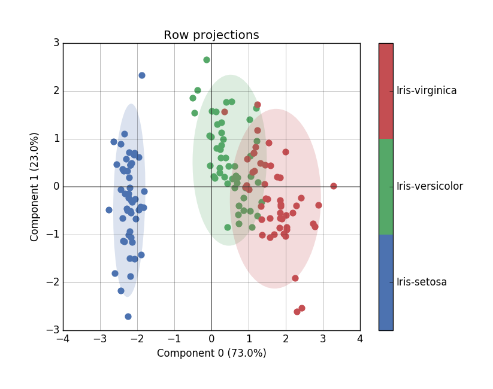
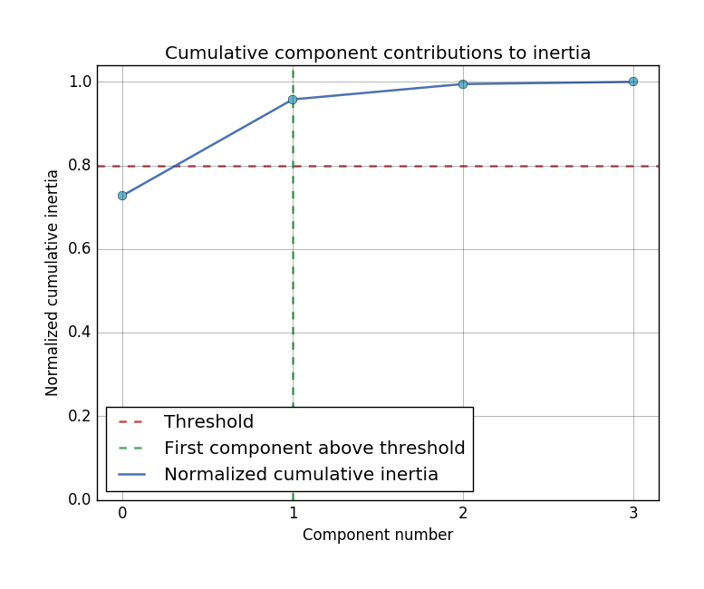

<div align="center">
  
</div>

<br/>

<div align="center">
  <a href="https://travis-ci.org/MaxHalford/Prince?branch=master">
    
  </a>
  <a href="https://coveralls.io/github/MaxHalford/Prince?branch=master">
    
  </a>
</div>

<br/>

<br/>
<div align="center">Prince is a factorial analysis library for datasets that fit in memory.</div>
<br/>


## Example

Prince uses [pandas](http://pandas.pydata.org/) to manipulate dataframe, as such it expects an initial dataframe to work with. In the following example, a [*Principal Component Analysis* (PCA)](https://www.wikiwand.com/en/Principal_component_analysis) is applied to the iris dataset. Under the hood Prince decomposes the dataframe into two eigenvector matrices and one eigenvalue array thanks to a [*Singular Value Decomposition* (SVD)](https://www.wikiwand.com/en/Singular_value_decomposition). The eigenvectors can then be used to project the initial dataset onto lower dimensions.

```python
import matplotlib.pyplot as plt
import pandas as pd

import prince


df = pd.read_csv('examples/data/iris.csv')

pca = prince.PCA(df, nbr_components=4)

fig1, ax1 = pca.plot_cumulative_inertia()
fig2, ax2 = pca.plot_rows(color_by='class', ellipse_fill=True)

plt.show()
```

The first plot displays the rows in the initial dataset projected on to the two first right eigenvectors (the projections are called principal components). The ellipses are 90% confidence intervals.



The second plot displays the cumulative contributions of each eigenvector (by looking at the corresponding eigenvalues). In this case the total contribution is above 95% while only considering the two first eigenvectors.




## Installation

Although it isn't a requirement, using [Anaconda](https://www.continuum.io/downloads) is a good idea in general for doing data science in Python.

```sh
>>> pip install prince
```

Or

```sh
>>> pip install git+https://github.com/MaxHalford/Prince
```

### Dependencies

- [pandas](http://pandas.pydata.org/) for manipulating dataframes
- [matplotlib](http://matplotlib.org/) as a default plotting backend
- [fbpca](http://fbpca.readthedocs.org/en/latest/), [Facebook's randomized SVD implementation](https://research.facebook.com/blog/fast-randomized-svd/)

### Plotting backends

Prince provides plotting methods out-of-the-box. The plot results are of course editable, the idea being to make it easy for 90% of users to get a good looking chart in minutes.

- [X] [Matplotlib](http://matplotlib.org/)
- [ ] [Altair](https://altair-viz.github.io/)
- [ ] [Plotly](https://plot.ly/)
- [ ] [ggplot](http://ggplot.yhathq.com/)
- [ ] [Toyplot](https://toyplot.readthedocs.io/en/stable/)


## Background

Factorial analysis is a popular method for projecting/representing high-dimensional data on a smaller dimensions. This can be useful for

- visualizing (the data can be projected on a 2 or 3 dimensional chart),
- creating smaller datasets which preserve as much as possible the information contained in original dataset.

Although factorial analysis is popular, practitionners tend to mix concepts up -- *Principal Component Analysis* (PCA) **is not** *Singular Value Decomposition* (SVD). Moreover, more advanced methods that extend PCA such as *Correspondance Analysis* and *Factor Analysis of Mixed Data (FAMD)* are not very well known -- at least outside of French academia.

The Rennes university published [FactoMineR](http://factominer.free.fr/) in 2008; whilst being a library which offers many possibilities, FactoMineR doesn't seem to be actively maintained. What's more, FactoMineR and the underlying SVD operation are written in pure R, which isn't very efficient. In parallel, [Fast Randomized SVD](https://arxiv.org/pdf/1509.00296.pdf) has become an efficient way to obtain eigen{vectors|values} approximations in drastically less time than regular SVD.

The goal with Prince is to provide a user-friendly library for performing all sorts of large-scale factorial analysis. Although [Facebook](https://research.facebook.com/blog/fast-randomized-svd/) and then [sklearn](http://scikit-learn.org/stable/modules/generated/sklearn.decomposition.RandomizedPCA.html) have implemented randomized SVD, it isn't trivial for users to use them, let alone to understand and visualize results in a timely fashion.

Prince builds on top of Randomized SVD engines such as [fbpca](https://github.com/facebook/fbpca) to provide different kinds of algorithms with out-of-the-box charts. The main advantage of using randomized SVD is that the number of eigenvectors that are calculated can be chosen. This is particularly useful because often one only needs the first few eigenvectors to be able to plot relevant information.


## Implemented methods

### Basic

Basic methods are to be used when there isn't any intrinsic structure between variables in a dataset (for example a series of questions that have nothing to do with each other).

- [X] [Principal Component Analysis (PCA)](https://www.wikiwand.com/en/Principal_component_analysis) - For continuous variables
- [X] [Correspondence Analysis (CA)](https://www.wikiwand.com/en/Correspondence_analysis) - For two categorical variables (leading to a contingency table)
- [X] [Multiple Correspondence Analysis (MCA)](https://www.wikiwand.com/en/Multiple_correspondence_analysis) - For more than two categorical variables
- [ ] [Factor Analysis of Mixed Data (FAMD)](https://www.wikiwand.com/en/Factor_analysis_of_mixed_data) - For both continuous and categorical variables (incoming)


### Advanced

Advanced methods are to be used when variables or individuals are structured in a natural way (for example a survey with questions grouped around topics).

- [ ] [Generalized Procustean Analysis (GPA)](https://www.wikiwand.com/en/Generalized_Procrustes_analysis) - For continuous variables
- [ ] [Multiple Factorial Analysis (MFA)](https://www.wikiwand.com/en/Multiple_factor_analysis) - For both continuous and categorical variables
- [ ] Dual Multiple Factor Analysis - For when the individuals have to be considered in groups and the variables are continuous


## Usage

All of the usable properties and charts are detailed in the following Jupyter notebooks. The notebooks also serve as examples.

- [PCA](doc/pca.ipynb)


## Perfomance

Prince is made to be used on datasets that fit in memory. Currently `fbpca` is the SVD engine. A PCA on a dataframe of 1M rows and 100 columns took ~6 seconds on an 2013 MacBook Pro (i5, 16G RAM). For out-of-memory SVD and whatnot, check out [Dask](http://dask.pydata.org/en/latest/array-api.html#dask.array.linalg.svd_compressed) and [Spark](https://spark.apache.org/docs/1.2.0/mllib-dimensionality-reduction.html).


## Delving into the maths

Factor analysis is quite a popular topic. A lot of material is available online. The following papers are the ones we recommend. We find them short, thorough and kind to the eyes.

- [Eigenvalues](doc/papers/Eigenvalues.pdf)
- [Singular Value Decomposition](doc/papers/SVD.pdf)
- [Principal Component Analysis](doc/papers/PCA.pdf)
- [Correspondence Analysis](doc/papers/CA.pdf)
- [Multiple Correspondence Analysis](doc/papers/MCA.pdf)
- [Global overview](doc/papers/Overview.pdf)

For math oriented minds, [Halko's paper](doc/papers/Halko.pdf) is worth knowing about.


## FAQ

**After having applied one of Prince's algorithm's on my dataframe, I noticed it's values changed. Why?**

For performance reasons, Prince modifies the provided dataframe inplace. If you don't want the dataframe you provide to be modified, you can use the [`copy` method](http://pandas.pydata.org/pandas-docs/stable/generated/pandas.DataFrame.copy.html):

```python
import pandas as pd
import prince

df = pd.read_csv('iris.csv')
pca = prince.PCA(df.copy(deep=True))
```


## License

<a href="https://opensource.org/licenses/MIT">

</a>

